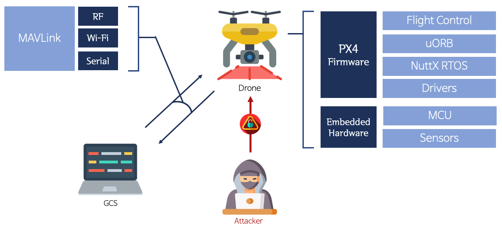
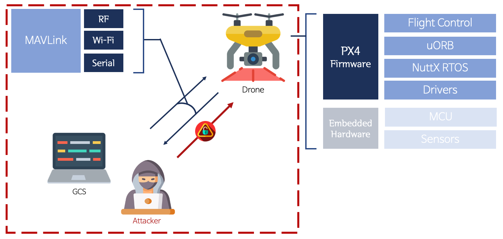

# Background and Objectives of Research <!-- omit in toc -->

## Table of Contents <!-- omit in toc -->

- [1. Research Background](#1-research-background)
  * [1.1. Drone Components](#11-drone-components)
    + [1.1.1. Hardware](#111-hardware)
    + [1.1.2. Software](#112-software)
  * [1.2. Possible damage](#12-possible-damage)
- [2. Scope of Research](#2-scope-of-research)
  * [2.1. Hardware](#21-hardware)
  * [2.2. Software](#22-software)
- [3. Research Objectives](#3-research-objectives)
  * [3.1. Non-Compromised](#31-non-compromised)
  * [3.2. Compromised](#32-compromised)
  * [2.3. Expected performance](#23-expected-performance)

- - -

## 1. Research Background

A Study on the Methodology of Finding Vulnerabilities to Reduce the Damage of Drone Security Accidents

### 1.1. Drone Components

#### 1.1.1. Hardware

**Basic Configuration**
```
- Drone Board: Fixhawk is widely used for large/special purpose drones, so Fixhawk 4 boards are used for research.
- Electronic speed control: Electronic speed control is used to control motor speed.
- Motor/Propeller: Motor has a fixed rotation direction and is divided according to the presence or absence of a brush.
- Battery: The output of the motor is determined by the number of cells.
- Charger: The motor does not work without a battery.
```

**Additional Configuration for Flight**
```
- GPS & Compass: Provide location information.
- Transmitter, Receiver: Generally, 2.4GHz band are used.
- Telemetry: The location and state of the drone are provided to a PC on the ground, using a 915 MHz or 433 MHz wireless channel.
- Frame: Fixing the boards and sensors.
```

#### 1.1.2. Software
```
- Operating System(OS)
  - Managing the drone's system hardware and applications.
- Ground Control Station(GCS)
  - Controlling drones on the ground.
  - e.g.) QGroundControl, Misson Planner, etc.
- Micro Air Vehicke Link(MAVLink)
  -  Protocol for Communicating with small unmanned vehicle.
```

### 1.2. Possible damage
  - Deodorization
  - Eavesdropping and Filming
  - Construction: Casualty
  - Agriculture: Crop or Economic Damage
  - Military: Crime, Terrorism, etc.


## 2. Scope of Research

It targets both open and closed sources used in drones.

Hardware has selected devices that are compatible with the software.

### 2.1. Hardware
- Sensors for Instrumentation
- RC Communications

### 2.2. Software
- Flight controller software(PX4, Ardupilot)
- OS(Nuttx)
- GCS(QGroundControl, Mission Planner)


## 3. Research Objectives

We aimed to explore new vulnerabilities and verify existing threat scenarios to improve the security of drone platforms.

Existing threat scenarios have verified vulnerabilities by attempting attacks on hardware such as major sensors and modules.
  - The method was classified as Non-Compromised because it could attack from outside without specific conditions.

The new vulnerability search verifies the vulnerability by attempting an attack with the drone/GCS in control.
  - When attacking drones, it is assumed that the GCS is in control.
  - When attacking the GCS, it is assumed that the drone is in control.

### 3.1. Non-Compromised

*When an attack is possible from outside without any set conditions.*



### 3.2. Compromised

*When the drone's network is accessible.*




### 2.3. Expected performance
- Making a hacking scenario.
- Report on vulnerabilities, issue CVE.
- Extracting Guideline.
- contribution to a paper.

---

## Table of Contents <!-- omit in toc -->

### Introduction <!-- omit in toc -->
   1. [Research background and goal](/1-intro/about-drone-research.md)
   2. [Previous studies](/1-intro/related-work.md)

### Methodology <!-- omit in toc -->
   1. [UAV software](/2-body/1_software-uav.md)
      1. [Flight controller software](/2-body/1_software-uav.md/#1-fcsflight-controller-software)
      2. [MAVROS](/2-body/1_software-uav.md/#2-nuttx-rtos)
   2. [Ground Control System software](/2-body/2_software-gcs.md/)
   3. [Hardware](/2-body/3_hardware.md)
       1. [GPS Module](/2-body/3_hardware.md/#1-gps-module)
       2. [PX4 Optical Flow](/2-body/3_hardware.md/#2-px4-optical-flow)
       3. [PX4 Telemetry Radio](/2-body/3_hardware.md/#3-px4-telemetry-radio)
       4. [Wifi Module](/2-body/3_hardware.md/#4-wifi-module)

### Result <!-- omit in toc -->
   1. [Project results](/3-conclusion/result.md)

