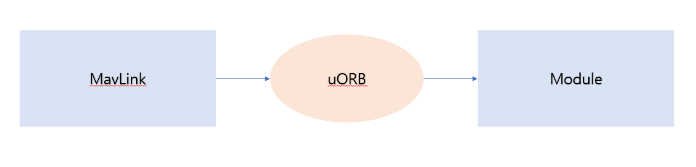
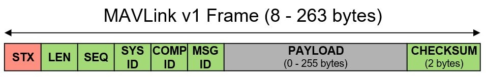
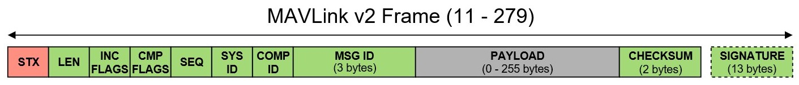
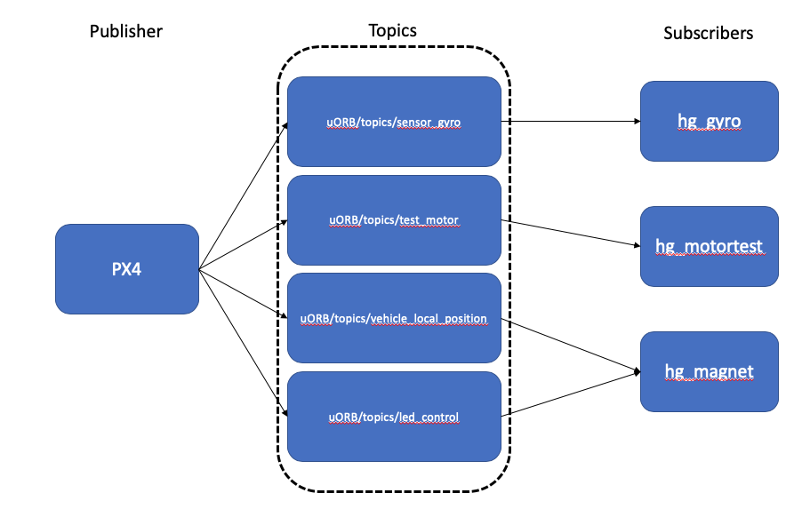
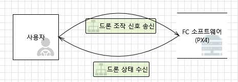
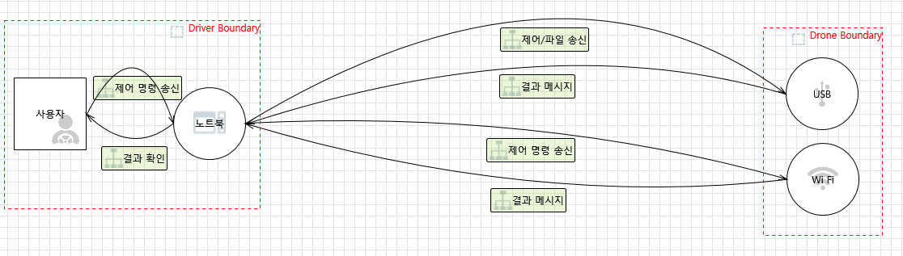
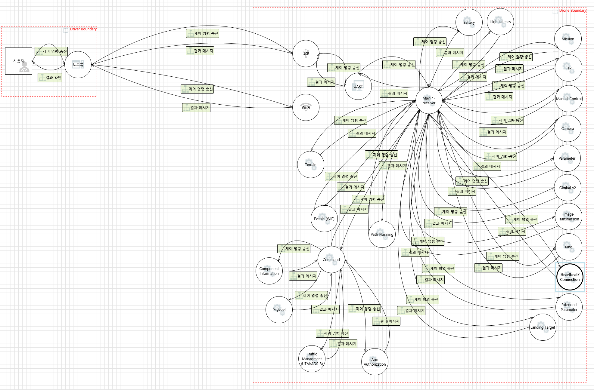
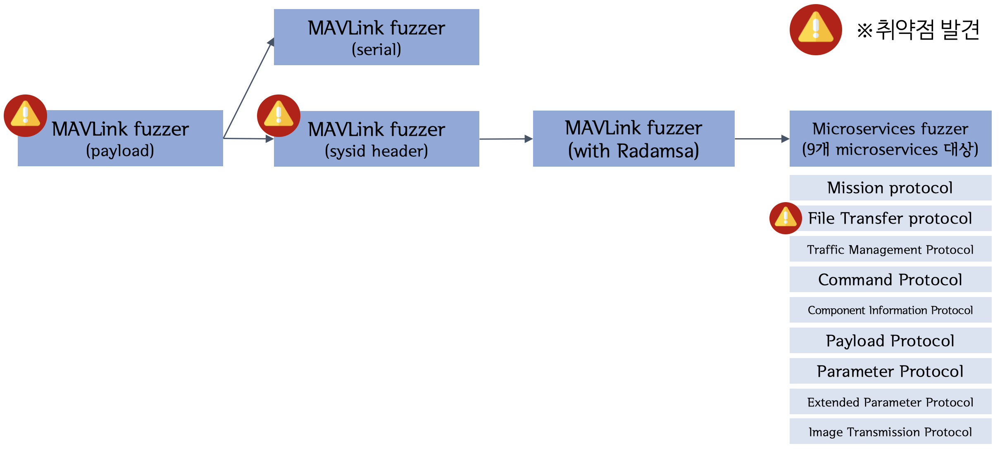
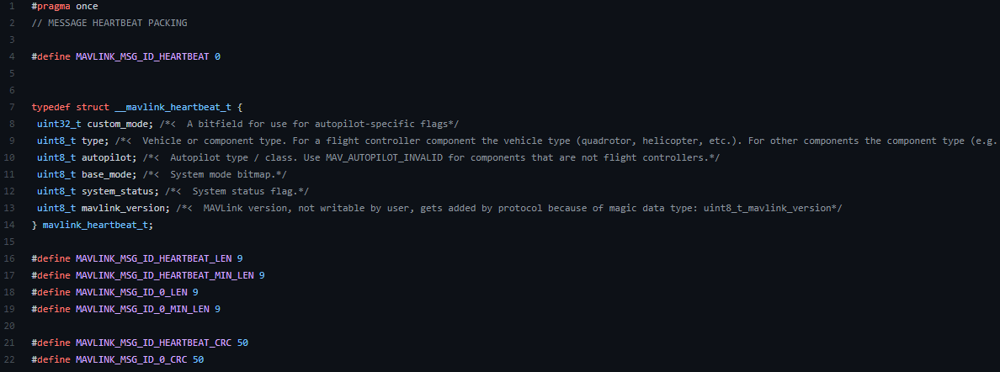

# An unmanned aerial vehicle(UAV) software.  <!-- omit in toc -->

## Table of Contents

- [1. FCS(Flight Controller Software)](#1-fcsflight-controller-software)
  - [1.1. Introduction](#11-Introduction)
  - [1.2. PX4 / Ardupilot Structure](#12-px4--ardupilot-Structure)
    - [1.2.1. MAVLink Protocol](#121-mavlink-Protocol)
    - [1.2.2. uORB API](#122-uorb-api)
  - [1.3. PX4 Build](#13-px4-Build)
    - [1.3.1. PX4 CLI Build](#131-PX4-CLI-Build)
    - [1.3.2. PX4 Docker Build](#132-PX4-Docker-Build)
  - [1.4. DFD](#14-dfd)
    - [1.4.1. Level 0](#141-level-0)
    - [1.4.2. Level 1](#142-level-1)
    - [1.4.3. Level 2 (PX4 MicroServices)](#143-level-2-px4-microservices)
  - [1.5. Vulnerability Analysis Methodology](#15-Vulnerability-Analysis-Methodology)
    - [1.5.1. Developing a Fuzzer](#151-Developing-a-Fuzzer)
      - [1.5.1.1. Setting Input Vector](#1511-Setting-Input-Vector)
      - [1.5.1.2. Data Collection For MAVLink Fuzzer](#1512-Data-Collection-For-MAVLink-Fuzzer)
      - [1.5.1.3. Fuzzing Environment](#1513-fuzzing-Environment)
      - [1.5.1.4. Mavlink Fuzzer](#1514-mavlink-fuzzer)
      - [1.5.1.5. Microservice Fuzzer](#1515-microservice-fuzzer)
      - [1.5.1.6. PX4 with AFL](#1516-px4-with-afl)
      - [1.5.1.7. GPS Fuzzer](#1516-gps-fuzzer)
    - [1.5.2. Fuzzing using serial communication.
](#152-Fuzzing-using-serial-communication.)
  - [1.6. Reference](#16-Reference)
- [2. Mavros](#2-mavros)
  - [2.1. Introduction](#21-Introduction)
  - [2.2. Analysis Environment Setting.](#22-Analysis-Environment-Setting.)
  - [2.3. Vulnerability analysis methodology.](#23-Vulnerability-analysis-methodology.)
    -[2.3.1 Vulnerability analysis through fuzzing](#231-Vulnerability-analysis-through-fuzzing)
- - -

## 1. FCS(Flight Controller Software)

### 1.1. Introduction

We use a Flight Controller (FC) called Pixhawk. Fix Hawk is a hobby for developers.
It is a public hardware project that is used by users around the world and can implement FC with high reliability according to individual efforts.

When analyzing vulnerabilities, we conducted vulnerability analysis in a drone simulation environment called SITL provided by PX4 for safety or cost, and conducted a second verification to see if vulnerabilities were expressed by applying them to actual drone devices.


### 1.2. PX4 / Ardupilot Structure

Update the status of the drone through an asynchronous messaging API called uORB.

GCS and drones communicate using the MAVLink protocol, process PAYLOAD, the data part of MAVLink, and publish the processed value to the Topics of uORB to update the drone's status.



#### 1.2.1. MAVLink Protocol

MAVLink stands for "Micro Air Vehicle Link" and was created for communication with small drones.
It provides stable data exchange with a lightweight communication protocol.
It is widely applied to several unmanned vehicles (UAVs) and GCSs.
GCS can be configured using this protocol, which allows you to control all parts of the fixhawk and obtain information.

MAVLink Protocol has version 2 and version 1 and has lower compatibility, so lower versions can be used in higher versions.  

**MAVLink v1**

MAVLink protocol version 1 consists of 6 headers, 1 checksum, and 1 data.   




**MAVLink v2**

MAVLink protocol version 2 consists of eight headers, checksums, signatures, and data.



Structure

* Packet start marker (STX): Magic value indicating the starting point of the packet.
* Payload length (LEN): PAYLOAD Length
* Incompatibility Flags: It is used to indicate a function that needs to be supported to process packets
* Compatibility Flags: Use to indicate that the MAVLink library does not interfere with processing packets even if it does not understand the function.

* Packet Sequence (SEQ): MAVLink Packet sequence
* SYSTEM_ID (SYS): Set the SYS ID so that multiple platforms can use the same network.
* Component ID (COMP): Set the component ID to receive multiple components on one platform.
* Message ID (MSG): MAVLink Packet's mission-setting value.
* DATA (PAYLOAD): Data values according to the actual MSG_ID transmitted.
* Checksum: Checksum
* Signature: Signature for integrity verification

**The difference between v2 and v1.**

* MAVLink version 2 has an MSG_ID size of 3 bytes. - Allow more than 16 million unique message definitions (MAVLink 1 is limited to 256)
* Added SIGNATURE value to verify packet integrity.
  * However, PX4 does not have a process of verifying SIGNATURE. (No integrity verification.)

#### 1.2.2. uORB API

uORB is short for Micro Object Request Broker and is one of the asynchronous messaging IPC communication techniques.
   
It works through Public-Subscription.


**UORB messaging. Organize the terms.**
* Node : Subject to exchange uORB messages. It's also called Process.
* Topic : Unit of information exchanged between the two nodes.
* Publish : The process of updating the value of Topic by raising the value to one Topic.

* Subscribe : The process of updating by importing values for one Topic.
* Advertise : When you first publish, you bring the list to publish-subscribe to Master Node, which is called Advertising.


```Ex) First, get a list of data to publish-subscribe to Masternode, and then calculate the value of PAYLOAD according to MAVLink's msgID, publish the calculated value to Topics, and the module updates the value of uORB by Subscripting the published value to Topics.```

### 1.3. PX4 Build
#### 1.3.1. PX4 CLI Build
**PX4 Download**
The PX4 source code may be downloaded through the following instructions.   
```
$ git clone https://github.com/PX4/PX4-Autopilot.git --recursive
```
To run the simulator, you must pre-install the execution environment with the script below.
jdk, Python, etc. should be installed.
  
```
$ bash ./PX4-Autopilot/Tools/setup/ubuntu.sh
```
이후 원하는 시뮬레이터를 지정해서 make를 진행한다.   
시뮬레이터는 jMAVSim, Gazebo 등이 있으며 공식 문서는 Gazebo를 추천한다.   
```
Start JMavSim with Address Sanitizer(default vehicle model)
$ make px4_sitl jmavsim PX4_BUILD_TYPE=0 PX4_ASAN=1
```
#### 1.3.2. PX4 Docker Build
PX4 is provided with a pre-built container with all development environments set. If you use [the container provided](https://github.com/PX4/PX4-containers/blob/master/README.md#container-hierarchy), you can easily attempt purging.
First, the docker must be installed with the instructions below.
Next, execute an instruction to set the authority.


```
$ curl -fsSL get.docker.com -o get-docker.sh
$ sudo sh get-docker.sh

Create docker group (may not be required)
$ sudo groupadd docker
Add your user to the docker group.
$ sudo usermod -aG docker $USER
```
Download the source code from the host computer with the command below.
```
$ mkdir src
$ cd src
$ git clone https://github.com/PX4/PX4-Autopilot.git
$ cd PX4-Autopilot
```
PX4 is executed using a script provided to use the container.
Alternatively, you can directly use the command line with the bash option. 
```
build SITL
$ ./Tools/docker_run.sh 'make px4_sitl_default'

start a bash session
$ ./Tools/docker_run.sh 'bash'
```
We are providing pre-made Docker files for Fuzzing.

For more information, refer to [here](../README.md).

### 1.4. DFD
#### 1.4.1. Level 0
Level 0 briefly represents the FCS and the user's main data flow.

#### 1.4.2. Level 1
Level 1 is configured by dividing the area into a drone and a GCS.
The drone part represents only the ports used for vulnerability analysis. 

#### 1.4.3. Level 2 (PX4 MicroServices)
The level 2 service version organizes how the microservice is processed inside PX4.
All of these parts were analyzed and a new Fuzzer was developed to target this part.
   

### 1.5. Vulnerability Analysis Methodology
#### 1.5.1. Developing a Fuzzer
We developed fuzzers by analyzing PX4 source code auditioning, and we decided to increase the scope of mutation or purging according to the protocol.
As it was upgraded in this way, additional vulnerabilities were found.

##### 1.5.1.1 Setting Input Vector
The Input value used to process the state of the drone is MAVLink Protocol. The state of drones is handled by MAVLink Protocol MSG_ID, and the configuration of the maximum minimum length and value of the PAYLOAD portion in the structure of Protocol varies depending on the MSG_ID.
##### 1.5.1.2 Data Collection For MAVLink Fuzzer
[MAVLink github](https://github.com/mavlink/c_library_v2) shows the "EXTRA_CRC" value added to distinguish MSG_ID from CRC value as shown in the picture below, and PAYLOAD's "max length" and "minimum length" are defined. We parsed all of these values and used them for Fuzzer development. For additional information according to MSG_ID, refer to the [MAVLink Guide Page](https://mavlink.io/en/messages/common.html).



##### 1.5.1.3 Fuzzing Environment
As a result of auditioning the source code to find a function that processes the MAVLink Protocol, it was confirmed that packets were processed by MSG_ID through case syntax in ["mavlink_receiver.cpp"](https://github.com/PX4/PX4-Autopilot/blob/master/src/modules/mavlink/mavlink_receiver.cpp#L115) starting with ["mavlink_main.cpp"](https://github.com/PX4/PX4-Autopilot/blob/master/src/modules/mavlink/mavlink_main.cpp) on PX4. In addition, PX4 confirmed that there was a virtual drone simulation called SITL and that it works in the same form as the picture below. It can be seen that this SITL can transmit the MAVLink Packet to 18570 port via UDP to "mavlink_main.cpp" that processes the MAVLink Protocol. So we proceeded with purging targeting mavlink_main.cpp -> mavlink_receiver.cpp through SILT.


##### 1.5.1.4 Mavlink Fuzzer
* Increase coverage by satisfying the Mavlink packet structure.
* Checksum automatic calculation (using Crcc16Mcrf4xx)
* Meet the maximum and minimum length per msgid (using data parsed at 1.5.1.2).
* Crash auto detection.
* Distinguishing between the mutable packet field and the mutable packet field.
  - Reason: When mutating the entire packet, the packet's shape is broken and the packet does not reach the handler function.
  - mutation part : sysid, compid, payload
  
* [4D Fuzzer](https://github.com/BOB4Drone/4D-Fuzzer)
##### 1.5.1.5 Microservice Fuzzer
* Add Microservice, a parent protocol, to facilitate interaction than the existing Mavlink protocol.
* Requires more interaction than traditional Mavlink protocols
  * EX) Interaction of FTP protocols when creating files through FTP protocols.

  
  
* So, we need to adjust the order and contents of sending packets in more detail.

* Classifying the Microservice used in PX4, analyzing each Microservice, and developing fuzzers.
  |Mission|FTP|Traffic Management|Command|Component Information|payload|parameter|Extend parameter|Image Trasmission|
  |-------|---|------------------|-------|---------------------|-------|---------|----------------|-----------------|
* [4D Fuzzer](https://github.com/BOB4Drone/4D-Fuzzer)
#### 1.5.1.6 PX4 with AFL
##### AFL fuzzing attempt using the network.
* Design a way to send the mutated part in the form of a Mavlink packet through AFL.

* Different MSGIDs have different Mavlink Packet forms, requiring separate fuzzing by MSGIDs -> consuming a lot of resources
* It's inefficient because PX4 booting is too slow.
* Therefore, it is judged that the 4D fuzzer developed above is more efficient.
##### AFL fuzzing attempt using Harness.
* Use Harness to get the Mavlink handling part to speed up and try fuzzing
* Identify PX4 compilation structure (module file -> library -> link to one binary)

* It created Harness with the desired handler function, but failed because it failed to satisfy the dependency due to many elements that interact with other modules.

#### 1.5.1.7 GPS Fuzzer
* It targeted the UBX protocol, a protocol that receives gps from PX4 as default.
    ```
    case gps_driver_mode_t::UBX:
		_helper = new GPSDriverUBX(_interface, &GPS::callback, this, &_report_gps_pos, _p_report_sat_info,gps_ubx_dynmodel, heading_offset, ubx_mode);
		set_device_type(DRV_GPS_DEVTYPE_UBX);
		break;
    ```
* First, we identified the structure of the UBX protocol.
    
* It was difficult to generate and send packets directly because they had to receive input through the GPS module.
* Therefore, a purging module was manufactured to mutate the input GPS value.

    mutation code
    ```
    void input_checksum(uint8_t data){
        ck_a = (ck_a + data) & 0xff;
        ck_b = (ck_b + ck_a) & 0xff;
    }

    void mutation(uint8_t* data, int size){
        int i;
        /*mutate payload*/
        srand((unsigned int)time(NULL));
        for(i = 0; i < size; i++){
                if(data[i] == 0xb5 && data[i+1] == 0x62){
                        packet_size = data[i+4];
                        cur_size = 0;
                        ck_a = 0;
                        ck_b = 0;
                        for (int k = i+2; k < i+6; k++){
                                input_checksum(data[k]);
                        }
                        i += 5;
                }
                else if(cur_size == packet_size){
                        data[i] = ck_a;
                        data[i+1] = ck_b;
                        i += 1;
                }
                else{
                        cur_size++;
                        uint8_t rand_byte = rand() % 0xff;
                        data[i] = rand_byte;
                        input_checksum(data[i]);
                }
        }

    }
    ```
    
    Puzzing module code - When executing the module, the global variable was turned into True and purged.

    ```
    #include <px4_platform_common/log.h>
    #include <px4_platform_common/my.h>
    bool fuzz;
    u_int8_t ck_a;
    u_int8_t ck_b;
    int packet_size;
    int cur_size;
    __EXPORT int fuzz_test_main(int argc, char *argv[]);
    int fuzz_test_main(int argc, char *argv[])
    {
        fuzz = true;
        PX4_INFO("fuzzing start!");
        return OK;
    }
    ```
    
    * As a result of executing the purging module, it was confirmed that the mutated gps values entered normally.

    
        
#### 1.5.3. Fuzzing using serial communication.
Actual devices had to be used to test vulnerabilities from simulator fuzzing.
This allows you to check if it is operating on an actual device.
The communication speed can be set to 115,000 when connecting USB.
As a result of comparing the communication speed between UDP and serial, it was confirmed that UDP was faster with an average difference of about 4 seconds.
**How To Use**
Download Image
```
$ docker pull ashinedo/4-drone:PX4-1.0
```
Image execution.  
The PX4 version where the vulnerability was found is installed and Fuzzer is automatically executed.
```
$ docker run -it --rm ashinedo/4-drone:PX4-1.0
```
If you don't want Fuzzer to run automatically, you can enter the command directly through the bash option.

```
$ docker run -it --rm ashinedo/4-drone:PX4-1.0 bash
```
Since docker images take up a lot of capacity, remove them after use.
```
Local image listing.
$ docker images

Remove local images using tags.
$ docker rmi ashinedo/4-drone:PX4-1.0
```
Docker Image under distribution
**[PX4-1.0](https://hub.docker.com/layers/178199113/ashinedo/4-drone/PX4-1.0/images/sha256-c1623af96905cf568545083de81363e87fcd66dd38b717dae300b5e84184c711?context=repo)** - MAVLink fuzzer(sysid header)
### 1.6. Reference
* https://mavlink.io/en/
* https://docs.px4.io/master/ko/
* https://nxp.gitbook.io/hovergames/developerguide/px4-tutorial-example-code/hg-px4-example-lab-1
## 2. MAVROS
### 2.1. Introduction
MAVROS is a package that executes MAVLink scalable communication between systems running ROS. Mainly, mavros is used when using Mission Computer.
### 2.2. Analysis Environment Setting.

```
mkdir -p ~/catkin_ws/src
cd ~/catkin_ws
catkin init
wstool init src
```
```
sudo apt-get install python-catkin-tools python-rosinstall-generator -y
```
```
rosinstall_generator --rosdistro kinetic mavlink | tee /tmp/mavros.rosinstall
```
```
wstool merge -t src /tmp/mavros.rosinstall
wstool update -t src -j4
rosdep install --from-paths src --ignore-src -y
```
```
./src/mavros/mavros/scripts/install_geographiclib_datasets.sh
```
`~/catkin_ws/src/mavros/libmavconn/cmake/Modules/~/catkin_ws/src/mavros/libmavcon/cmake/Modules` to change as follows.

```
# This module enables C++11 or C++14 support
# 
# thanks for: http://www.guyrutenberg.com/2014/01/05/enabling-c11-c0x-in-cmake/

include(CheckCXXCompilerFlag)

check_cxx_compiler_flag("-std=c++14" COMPILER_SUPPORTS_STD_CXX14)
if (NOT COMPILER_SUPPORTS_STD_CXX14)
  check_cxx_compiler_flag("-std=c++11" COMPILER_SUPPORTS_STD_CXX11)
endif ()

if (COMPILER_SUPPORTS_STD_CXX14)
  set(CMAKE_CXX_FLAGS "${CMAKE_CXX_FLAGS} -fsanitize=address -std=c++14")
elseif (COMPILER_SUPPORTS_STD_CXX11)
  set(CMAKE_CXX_FLAGS "${CMAKE_CXX_FLAGS} -fsanitize=address -std=c++11")
else ()
  message(FATAL_ERROR "The compiler ${CMAKE_CXX_COMPILER} has no C++11 support. Please use a different C++ compiler.")
endif ()
```
```
cd ~/catkin_ws
catkin build
source devel/setup.bash
```
### 2.3. Vulnerability analysis methodology.
#### 2.3.1. Vulnerability analysis through fuzzing
MAVROS also uses the same mavlink protocol as PX4, so we were able to find vulnerabilities with our developed [4dfuzzer]().
### Introduction <!-- omit in toc -->
   1. [Research background and goal](/1-intro/about-drone-research.md)
   2. [Previous studies](/1-intro/related-work.md)

### Methodology <!-- omit in toc -->
   1. [UAV software](/2-body/1_software-uav.md)
      1. [Flight controller software](/2-body/1_software-uav.md/#1-fcsflight-controller-software)
      2. [MAVROS](/2-body/1_software-uav.md/#2-nuttx-rtos)
   2. [Ground Control System software](/2-body/2_software-gcs.md/)
      1. [Introduction](/2-body/2_software-gcs.md/#1-introduction)
      2. [Analyze Environment](/2-body/2_software-gcs.md#2-analyze-environment)
      3. [Vulneralility Analysis Methodology](/2-body/2_software-gcs.md#3-vulnerability-analysis-methodology)
   4. [Hardware](/2-body/3_hardware.md)
       1. [GPS Module](/2-body/3_hardware.md/#1-gps-module)
       2. [PX4 Optical Flow](/2-body/3_hardware.md/#2-px4-optical-flow)
       3. [PX4 Telemetry Radio](/2-body/3_hardware.md/#3-px4-telemetry-radio)
       4. [Wifi Module](/2-body/3_hardware.md/#4-wifi-module)

### Result <!-- omit in toc -->
   1. [Project results](/3-conclusion/result.md)
